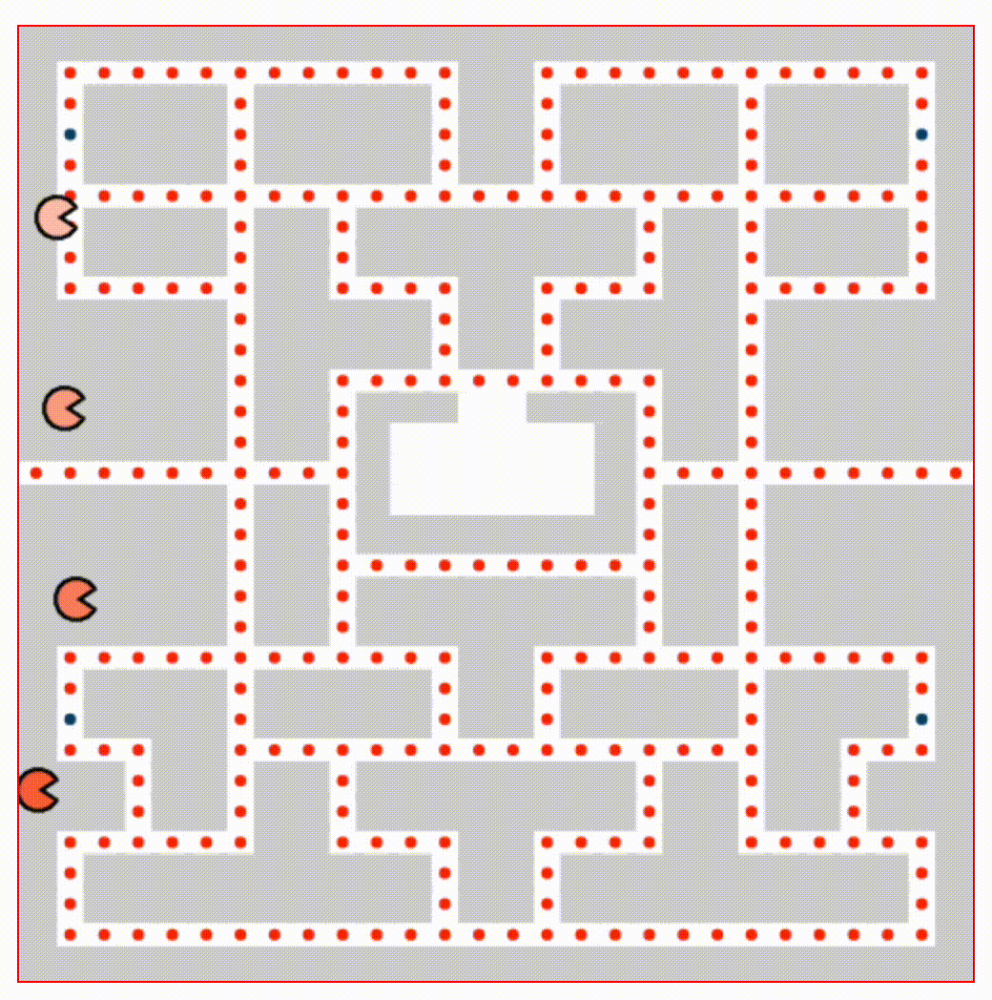

# Pacman Map

# Objetivo

Dibujar el mapa del Pacman

Los pacmas tienen movimiento hacia arriba, abajo, derecha e izquierda.

# Recursos

Hemos usado canvas

# Mejoras
Hacer que el pacman interactúe con el mapa.
